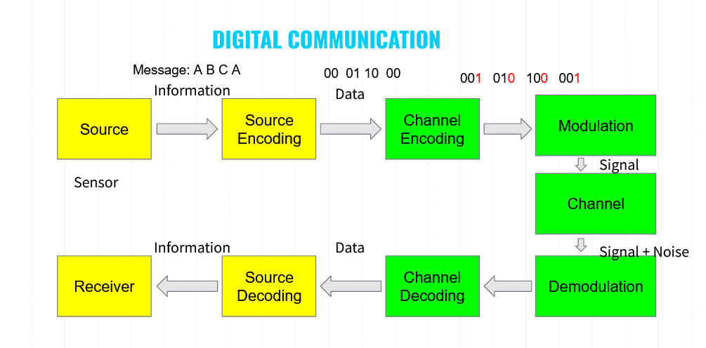
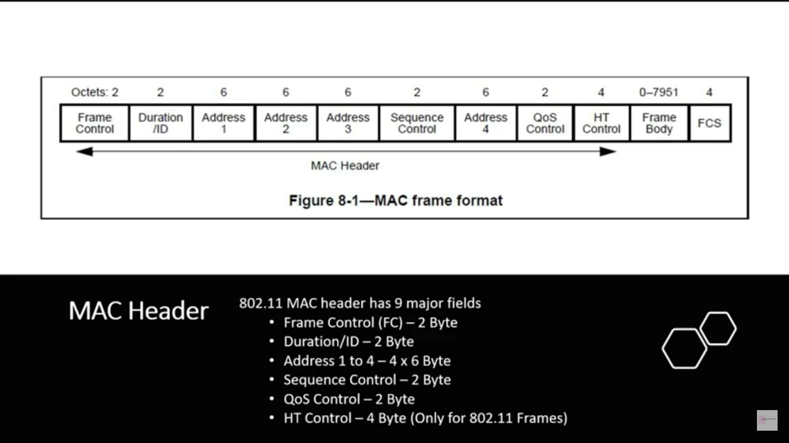
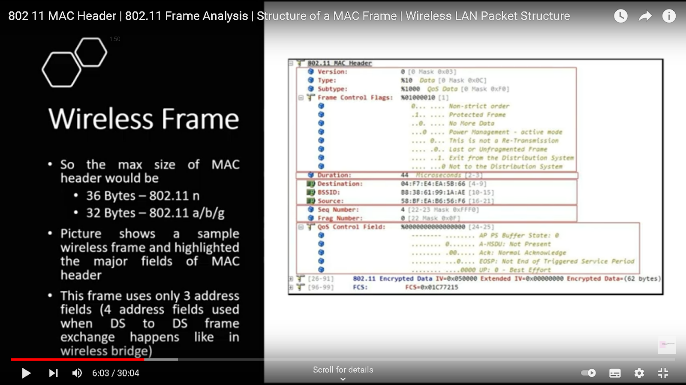
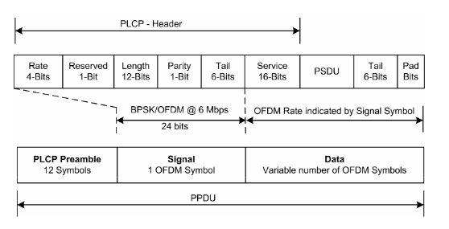
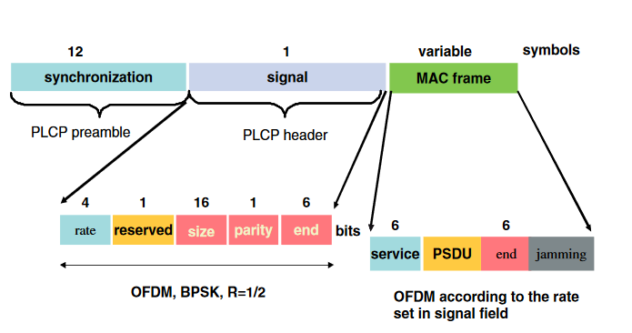
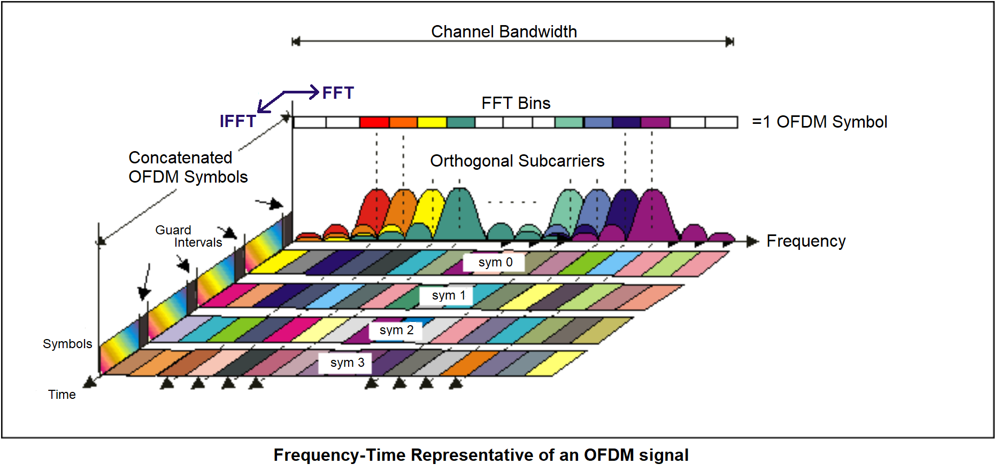

# Telecommunication-Network

Global catastrophic risks that threaten to destroy or cripple human civilization. What lies beneath day-to-day reality is a fantastically complex web of phenomena. Perturb that web, poke it or shove it, and there are ripples that don’t always settle quickly.  Planetary climate is one major structural element of the web, and is perfectly happy to ripple and slide over to states that modern humans I haven't experienced this before.  The humans by this time have decided to make an interstellar colony with the launch of interplanetary or interstellar spacecraft . Communications with a growing population of exploration vehicles and settlements within a planetary system, or with probes launched to other stars, could also create a noisy beacon for other species to detect. And perhaps the ultimate in last-ditch attempts to avert a slow-rolling planetary disaster is to send out a distress signal, looking for answers to existential challenges; because at that point why not? A group of Apocalyptic fanatics must use their knowledge of digital communication to save the world. You have been tasked to design and implement a transmitter and receiver system that is capable of achieving this task of making external contact.

After implementing the basic filter in [**PS1**](https://drive.google.com/file/d/1K-Q769eI4hD5HQTjU-G_cNm_K-4oOSci/view) you realize that the data speed and bit error rate is not up to the mark and now have to think about implementing something more scalable that does not interfere with others and also provides high data speed .



We encode the transmitter and receiver to simulate the throughput and BER.

Features simulated :

1. Lossless compression (QOI) [1]
2. Packetization 
3. OFDM
4. Source (10) : Load the Video 
5. Source encoding (15) : convert the values into binary bits
6. Channel encoding (15) : Add parity bit or crc or any other coding scheme
7. Modulation + Channel + Demodulation (30). 

## 1. QOI

QOI is fast. It losslessy compresses images to a similar size of PNG, while offering 20x-50x faster encoding and 3x-4x faster decoding. QOI is simple. The reference en-/decoder fits in about 300 lines of C.  The file format specification is a single page PDF. 

References :

1. https://qoiformat.org/qoi-specification.pdf
2. https://youtu.be/EFUYNoFRHQI 
3. https://github.com/kodonnell/qoi 

## 2. Packetization

We approximately follow the IEEE 802.11 standard for wireless communication and accordingly make the MAC(Data Link Layer) and PHY(Physical Layer) packets to be transmitted.

### Basic MAC Frame Format





References:

1. https://www.youtube.com/watch?v=wb4LhU-9ZuY [Good one]
2. https://link.springer.com/content/pdf/bbm%3A978-1-4020-5397-9%2F1.pdf 
3. https://en.wikipedia.org/wiki/IEEE_802.11 
4. https://www.youtube.com/watch?v=vN-6jQaWI1g
5. https://youtu.be/vN-6jQaWI1g 
6. https://in.mathworks.com/help/wlan/ug/802-11-mac-frame-generation.html 
7. https://mrncciew.com/2014/10/03/cwap-mac-header-qos-control/ 

#### Basic PHY Frame Structure





References : 

1. https://rfmw.em.keysight.com/wireless/helpfiles/n7617a/ofdm_signal_structure.htm 
2. https://youtu.be/ucMaefcu2Y4 
3. https://rfmw.em.keysight.com/wireless/helpfiles/89600b/webhelp/subsystems/wlan-ofdm/content/ofdm_80211-overview.htm 
4. http://media.techtarget.com/searchMobileComputing/downloads/CWAP_ch8.pdf [Good One]
5. https://www.cnrood.com/en/media/solutions/Wi-Fi_Overview_of_the_802.11_Physical_Layer.pdf 

Overall References

1. https://github.com/Udyam/UDYAM-21-COMMNET-MAC-PHY-packet 

## 3. OFDM

Orthogonal frequency-division  multiplexing is a method of data transmission where a single information stream is split among several closely spaced narrowband subchannel  frequencies instead of a single Wideband channel frequency.

 

Read More :

1. [Fourier Analysis: Overview - YouTube](https://www.youtube.com/watch?v=jNC0jxb0OxE&list=PLMrJAkhIeNNT_Xh3Oy0Y4LTj0Oxo8GqsC) 
2. [2.4 - OFDMA/SC-FDMA IN 4G LTE - PART 2 - YouTube](https://www.youtube.com/watch?v=MBcGO3EC3Qs&list=PLE6yE0jB6BTOY6Z1DKEkQ8yZ8fFPUiCD8&index=6) 
2. [QPSK and OFDM with MATLAB System Objects - MATLAB & Simulink - MathWorks India](https://in.mathworks.com/help/comm/gs/qpsk-and-ofdm-with-matlab-system-objects-1.html) 

# Using Python in Matlab

### Install Supported Python Implementation

- Access https://www.python.org/downloads/ and scroll to the              **Looking for a specific release** section.

- Find the version you want and click **Download**. For supported version information, see [Versions of Python Compatible with MATLAB Products by     Release](https://www.mathworks.com/content/dam/mathworks/mathworks-dot-com/support/sysreq/files/python-compatibility.pdf).

- Click the format you want for the 64-bit version and follow the online instructions.

- Add to path

  C:\Users\prana\AppData\Local\Programs\Python\Python36

  C:\Users\prana\AppData\Local\Programs\Python\Python36\Scripts


Add python path to MATLAB , valid for <=2018 . From >=2019 pyenv is used.

```
pcPythonExe = 'C:\Users\dmattioli\AppData\Local\Programs\Python\Python37\python.exe';
[ver, exec, loaded]	= pyversion(pcPythonExe); pyversion
>> pyversion
       version: '3.7'
    executable: 'C:\Users\dmattioli\AppData\Local\Programs\Python\Python37\python.exe'
       library: 'C:\Users\dmattioli\AppData\Local\Programs\Python\Python37\python37.dll'
          home: 'C:\Users\dmattioli\AppData\Local\Programs\Python\Python37'
      isloaded: 1
% Add folders to python system path.
pyLibraryFolder = 'C:\Users\dmattioli\.PyCharm2019.1\system\python_stubs\278535617';
insert(py.sys.path, int64(0), pyLibraryFolder)
```

Install package for qoi implementation 

```bash
pip install qoi opencv-python numpy
```

Calling the custom function 

```matlab
%rgb and res are flattend , i.e. 1xN vector  
res=py.qoiReadWrite.encode(rgb)
rgb=py.qoiReadWrite.encode(res)
```

Note : The data types for MATLAB and python are different so their interconversion is yet to be figured and because of incompatibility of QOI with python 3.6 and compatibility of MATLAB 2018a with Python 3.6 it has been left. 

References :

1. https://in.mathworks.com/help/matlab/matlab_external/install-supported-python-implementation.html#bujjwjn

2. https://in.mathworks.com/help/matlab/ref/pyenv.html 
3. https://in.mathworks.com/help/matlab/matlab_external/call-user-defined-custom-module.html

